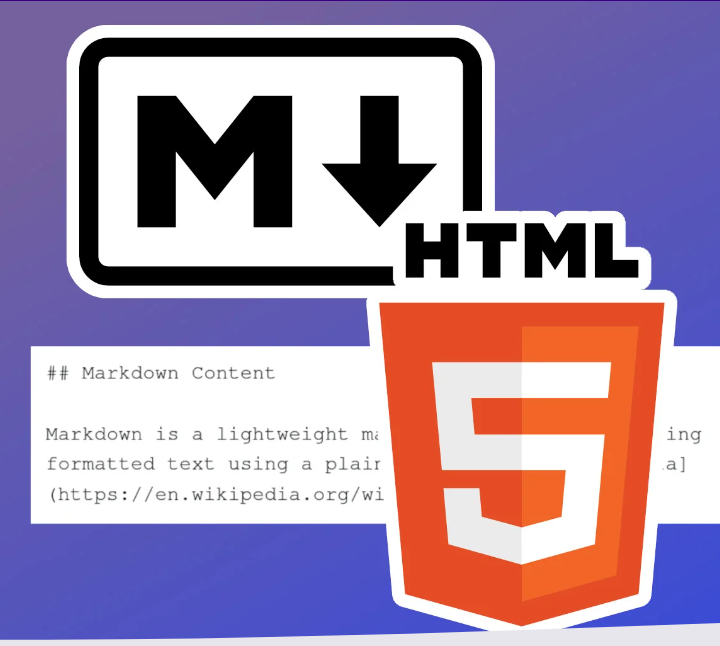
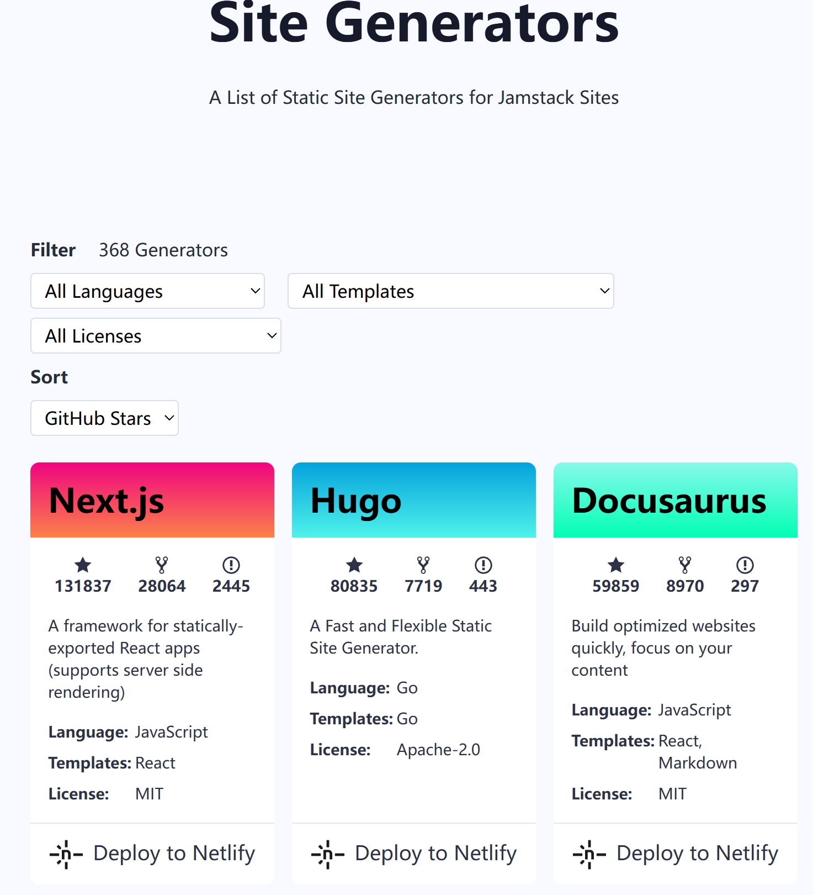
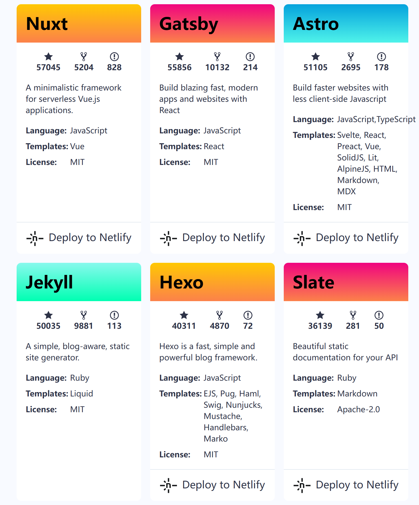
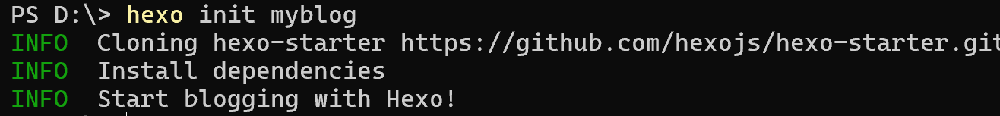
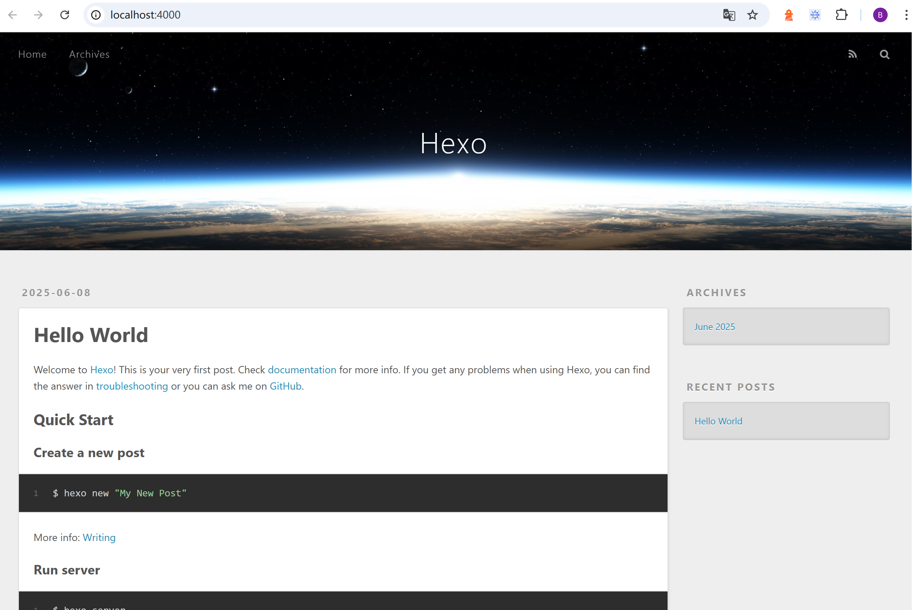

通过上一篇文章--[动手搭建自己的第一个博客站点](./build-personal-blog2.md)的介绍，相信你已经成功搭建起了自己的第一个博客网站。如果你的动手能力比较强的话，或许还给博客页面做了页面美工，添加了导航等功能。

如果你的博客还停留在手写html的阶段，也没有关系，通过这篇文章，让你在10分钟内学会如何使用工具生成漂亮好看的博客页面。


## 什么是 SSG

人类与其他动物的一个显著区别在于，人类擅长制造并使用工具，撰写博客亦是如此。如今，搭建站点撰写博客早已告别了需要手动逐行编写 HTML 代码的 “刀耕火种” 时代，众多优秀工具可供选择，助力我们快速实现更出色的博客呈现效果。

我们知道，一篇博客内容通常都是以HTML的形式存储的，但对于写博客的人来说，其更想要关注的是其内容本身，而不是各种HTML标签的排列组合和样式调整。



那么是否有一种工具，可以让撰写博客的人从书写HTML和各种样式调整中解脱出来，可以直接将纯文本内容转换成带漂亮样式的HTML文件呢？

有的，那就是静态站点生成器（Static Site Generator)。它是一种自动化工具，它通过模板和数据源（如 Markdown 文件、CMS 内容或 API 数据）生成完整的 HTML、CSS 和 JavaScript 文件。与传统动态网站不同，SSG 生成的页面在构建时就已完全渲染，无需在用户访问时依赖数据库或服务器端处理。


## 一些常见的SSG工具

下面是一些常见的SSG工具，其中包含一些大家都比较熟悉的，比如Next, Hugo, Jekyll还有Hexo之类的。




`Next.js`有完整的React生态支持，内置CSS模块化、图像优化和自动代码风格功能, 适合构建复杂交互应用。

`Hugo` 是一块由Go语言开发的超高速静态站点生成器，最大的特点就是，快！

`Jekyll` 算是一款老牌的静态站点生成器了，Github Pages原生就支持，非常适合搞小型项目展示页和个人博客。

`Hexo` 是一款Node.js生态的轻量博客框架，Markdown只有友好，非常适合中文写作。

工具那么多，我独爱Hexo! 

## Why Hexo?

在众多的SSG工具中，为什么为独独选择Hexo呢？ 除了是个人接触比较早之外，还有一些其它的深层次的原因。


**极低的入门门槛**，只需安装 Node 环境后，通过几条命令即可初始化站点，无需复杂配置。而且中文教程十分丰富，即使是新手，也能在10分钟之内搭建出一个基础博客。

**中文生态友好**，配置文件、错误提示等均为中文，对国内开发者更友好; 社区活跃，中文主题和插件资源丰富。

**灵活扩展，功能丰富**，插件系统完善，通过 npm 安装插件即可扩展功能；主题基于 EJS/Pug/Markdown 模板，支持自定义布局、样式和脚本。

如果你恰好也是一名前端开发工程师，日常开发中必然常常与Node打交道，那么对于自己写Hexo插件和主题是很有优势的，Hexo对于你来说是个很不错的选择。

## 实战操作

前面就说了，即使是新手，也能够在10分钟之内搭建出一个基础博客。如果你正在尝试着跟着步骤做，不妨计时验证一下。

多的话不说了，撸起袖子，开干！

- ### step1: 准备Node环境

  如果之前接触过Node或者已经安装过Node, 可以直接跳过该步骤，直接进入到step2。如果是Node新手，可以按照下面步骤来安装Node。
  - **方法1：安装包安装**

    a）前往[Node官网](https://nodejs.org/zh-cn/download)下载安装包，或者关注公众号“我做开发那些年”，后台回复“Node安装包”获取。<br>
    b) 双击安装包，开始安装, 傻瓜式的点击Next.


  - **方法2：可移动二进制文件安装**

      a）前往[Node官网](https://nodejs.org/zh-cn/download)下载安装包，或者关注公众号“我做开发那些年”，后台回复“Node独立文件包”获取。<br>
      b) 将包解压任意目录, 然后将其中的`bin`目录路径配置到环境变量 `path`中

  如安装过程过程中有疑问，可参考详细教程: [Node安装保姆级教程](./install-node.md)

  安装之后，打开命令行窗口，输入 `node -v` 验证，如果出现对应版本号，则说明安装成功了。

- ### step2: 安装Hexo脚手架

全局安装 **Hexo CLI**, 一行命令行就够了。

```
npm install hexo-cli -g 
```


- ### step3: 搭建博客

使用hexo脚手架，完成博客搭建操作
```
hexo init my-blog           # 初始化博客目录
cd my-blog && npm install   # 安装依赖
npm run server              # 启动本地预览（http://localhost:4000）
```
执行完上述操作之后，在浏览器中输入地址`http://localhost:4000`, 你将看到整个博客的样子，其中包含一篇默认的 `Hello world`博文。



如果你想要添加新的博客，执行 `hexo new post 文章标题`即可在 `source/_post`目录下生成一个新的 `.md`文件。如果不熟悉Markdown语法，可以查阅相关资料学习，上手其实挺快的。


### step4: 部署到Github Page

执行命令下方命令

``` bash
hexo generate
```

hexo将会把所有相关资源文件进行转换，最后所有的资源都都存放在 `public`目录下。将所有文件上传到上一篇文中提到的个人仓库或者使用git命令提交，等待一两分钟，访问自己的博客站点地址，你将看内容已经更新。


## 写在最后

Hexo 博客的默认主题是 `landscape`, 你也可以尝试着使用其它博客主题，如 `Next`, `Fluid`等。

如果你想对博客站点做些修改，可以通过编辑其根目录下配置文件 `_config.yml` 来进行调整。如果在主题样式上需要做修改，也可以编辑其对应的配置文件，对应的配置文件在 `/themes/主题名称/`中。

关于Hexo更多的配置可查阅其官方文档，里面都有十分详细的介绍。如果个人动手能力比较强，也可以尝试着写一些主题或者插件，那将是一件让你感到成就感满满的事情。

