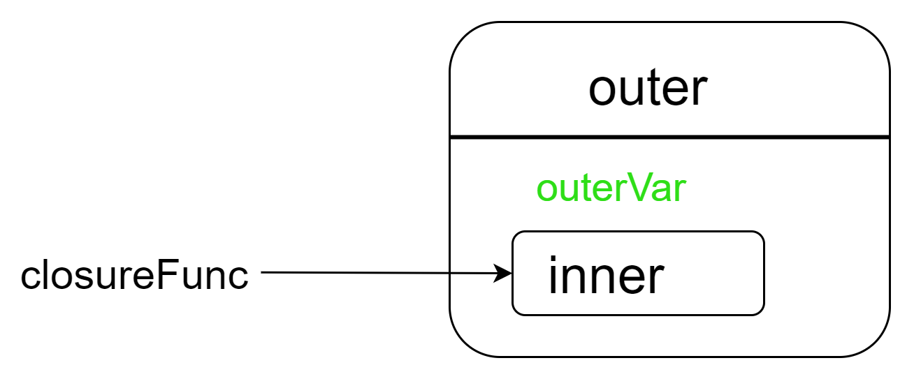

---

闭包，算得上是JavaScript中的一个难点，在面试时也被时常提及。

多年前的一次面试，被问及闭包时，那种脑子里一团乱麻的感觉，至今依然清晰。

本文力求以简单移动柜的语言，彻底讲清楚闭包，让读者在日后的面试和工作中，少走一些弯路，少掉一些头发。


## 什么是闭包？

要讲清楚闭包，那么我们首先得了解闭包是什么。为此，我翻阅许多资料收集了其中关于闭包的定义：

- **《JavaScript权威指南（第六版）》**： 函数对象可以通过作用域链相互关联起来，函数体内部的变量都可以保存在函数作用域内，这种特性在计算机科学文献中称之为“闭包”。

- **《JavaScript 高级程序设计》**： 闭包指的是那些引用了另外一个函数作用域中变量的函数，通常是嵌套在函数中实现的。

- **《你不知道的JavaScript》**： 函数可以记住并访问所在词法作用域，即使函数实在当前词法作用域之外执行，这就产生了闭包。

- **MDN**: 闭包是由捆绑起来（封闭的）的函数和函数周围状态（词法环境）引用组合而成，闭包让函数能够访问它的外部作用域。


好嘛，真是一看一个不吱声，根本没有一个统一的定义。有的说闭包是特性，有的直说是怎么形成的，各讲各话。

你就说，看这些东西，你能不蒙？

按我们的理解，定义就应该是 `xx是xx` 的格式，在这里我们以最简单的格式来定义闭包

**闭包是一个函数与其周围词法环境的集合**。当函数被定义时，他会捕获其外部作用域中的变量，即使外部函数已经执行完毕，这些变量依然可以被访问和修改。

以后再被问及什么是闭包的时候，粗体部分文字就是答案，剩下的则可以作为解释。


## 闭包的形成

搞清楚了闭包的定义，下面通过一个简单的案例直观地理解一下闭包的形成。

```
function outer() {
  let outerVar = "我是外部变量"; // 外部函数的局部变量

  // 内部函数定义（满足“函数嵌套”）
  function inner() {
    console.log(outerVar); // 内部函数引用外部变量（满足“作用域访问”）
  }

  return inner; // 内部函数被返回（满足“外部返回”）
}

// 内部函数被“带出”外部作用域，并赋值给全局变量
const closureFunc = outer(); 

// 在外部调用内部函数，闭包生效
closureFunc(); // 输出："我是外部变量"（成功访问outer的局部变量）
```

从上面的例子我们可以看出，outer执行完毕后，outerVar本应被销毁，但由于inner被返回并赋值给closureFunc，inner仍保留对outer作用域的引用。当closureFunc()调用时，inner通过闭包访问到了outerVar。



闭包形成的关键就在于内部函数在外部函数中定义时，会捕获当前的作用域链（包含外部函数的作用域和全局作用域）。即使内部函数未被立即调用，它也会保留对这些作用域的引用。

## 闭包的作用

明白了闭包的形成之后，我们再来看看闭包在实际开发过程中的一些用途。

当然了，下面的内容都是围绕着闭包的核心作用展开的：**让内部函数能够保留对外部作用域的引用，即使外部函数已经执行完毕**。

- **保存变量状态（数据私有化与封装）**

闭包可以将变量 “隐藏” 在外部函数的作用域中，只通过内部函数暴露操作接口，实现类似 “私有变量” 的效果，避免全局变量污染。

```javascript
function createCounter() {
  let count = 0; // 被闭包“保护”的变量，外部无法直接访问
  return {
    increment: () => { count++; return count; },
    decrement: () => { count--; return count; }
  };
}

const counter = createCounter();
console.log(counter.increment()); // 1（count被修改并保留状态）
console.log(counter.increment()); // 2（状态持续保留）
```

- **实现函数工厂（动态生成定制化函数）**

通过闭包可以创建带有 “记忆” 能力的函数，根据外部变量的不同生成不同逻辑的函数，提高代码复用性。

```javascript
function createGreeting(prefix) {
  return function(name) { // 内部函数记住prefix的值
    console.log(`${prefix}, ${name}!`);
  };
}

const sayHello = createGreeting("Hello");
const sayHi = createGreeting("Hi");

sayHello("Alice"); // "Hello, Alice!"（记住prefix为"Hello"）
sayHi("Bob");      // "Hi, Bob!"（记住prefix为"Hi"）
```

- **延迟执行与回调函数中的状态保留**

闭包可以保留回调函数创建时的上下文状态，避免因变量作用域变化导致的问题, 这个在涉及一些定时器、或者事件监听等操作时非常有用。

来一个大家都熟悉的例子

```
for (var i = 0; i < 3; i++) {
  // 使用闭包保留每次循环的i值
  (function(j) {
    setTimeout(() => {
      console.log(j); // 输出0、1、2（而非3次3）
    }, 1000);
  })(i);
}
```
若不使用闭包，定时器回调会共享全局的i，最终输出 3 次3；闭包则让每次循环的i值被独立保存。

- **模块化开发**

在 ES6 模块出现之前，闭包是实现模块化的核心方式：通过外部函数包裹代码，只暴露需要公开的接口，隐藏内部实现细节。


## 写在最后

Okay, 到这里想必都已经清楚了闭包的定义，它的形成和作用了，在日后的面试中和工作中遇到了闭包也用不着犯难了。

闭包在开发过程中应用非常广，在一些高级函数，封装操作或者状态管理中都能看到闭包的影子。

虽然好用，但是也不要滥用，过多的使用闭包可能占用过多内存，甚至引发内存泄漏，毕竟不是所有开发者都会自觉清理掉不必要引用的，哈哈，偷笑~。