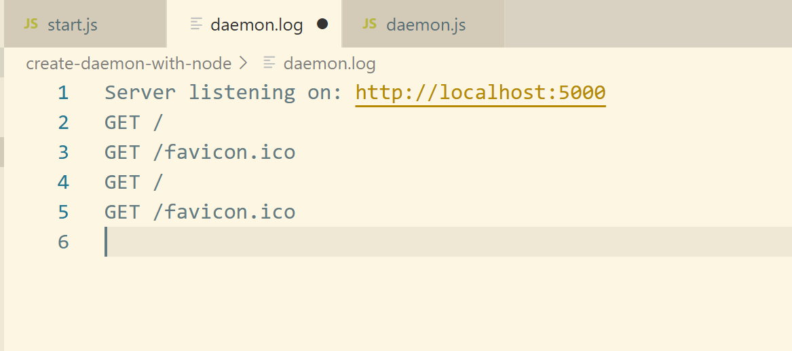

说到守护进程，绝大多数开发者其实都不陌生，甚至有些记性比较好的同学还能大段背诵关于进程的面试八股文呢。虽然在日常的Web开发工作中很少使用到它，而且可能从写Web第一天到离职都没有真正写过一个守护进程，即使有或许还是学校里教学用的--使用C语言实现的Demo。

不要怪作者嘴巴毒，事实就是这样的，即使一个工作5,6年的老Web开发，你让他现场写个守护进程，还真不一定就能立马写出来。今天就尝试着使用Node来实现一个守护进程，试着唤醒你那将要死去的记忆。

把一个大象关进冰箱分几步？ 写一个守护进程又分几步？

## 1. 创建子进程并脱离控制终端

当我们使用Node执行某一个js脚本时，Node会创建一个进程，当脚本执行结束了，进程也就结束了。

为了创建守护进程，需要在脚本执行的过程中(父进程)创建一个子进程，并且在子进程创建之后，要让其自立门户，脱离父进程，这样即使父进程退出，也不会影响子进程

```javascript
// start.js
const { fork } = require('child_process');
const path = require('path');

// 创建子进程
const child = fork(path.join(__dirname, 'daemon.js'), {
    detached: true,  // 使子进程成为新的进程组领导
    stdio: 'ignore'  // 忽略标准输入/输出/错误
});

// 解除父进程对子进程的引用
child.unref();

//父进程退出
process.exit(0);
```

如上述代码所示，使用 `chilrd_process`中的 `fork`方法创建一个子进程，它会自动建立父子进程间的 IPC 通信通道。其中的几个参数，详细讲解一下：

- 第一个参数 daemon.js 是要执行的子进程脚本路径，通过 `path.join(__dirname, ...)` 确保路径正确。
- 第二个参数是配置对象，包含关键选项：

  - **detached: true**​：使子进程成为新进程组的领导者（非 Windows 系统）或拥有独立控制台（Windows），允许子进程在父进程退出后继续运行

  - ​**stdio\: ignore**​：忽略子进程的标准输入/输出/错误流，避免管道阻塞问题

## 2. 设置工作目录和文件权限

```javascript
// daemon.js

// 改变工作目录到根目录或特定目录
process.chdir('/');

// 重设文件权限掩码
process.umask(0);
```

为了将守护进程独立于启动它的环境，我们通过改变工作目录来实现隔离，而且这样还可以避免挂载点无法卸载。

另外还需要关注一下权限的问题，将掩码设置为0，这样守护进程创建的文件和目录将使用系统的默认权限。


## 3. 配置日志模块

守护进程不同于在终端执行命令行的进程，它是不占用终端的，所以是看不到它输出内容在终端上。因此，需要配置一个日志模块，用于记录下一些关键信息，避免在报错或者调试的时候两眼抓瞎。

日志模块其实很简单，功能就是将内容记录到文本中即可

```javascript
// daemon.js

// 设置日志记录
const util = require('util');
const logFile = fs.createWriteStream('daemon.log', { flags: 'a' });
const log = function(msg) {
    logFile.write(util.format(msg) + '\n');
};

```


## 4. 处理信号和错误

为了提高守护进程的稳定性和可靠性，需要对一些系统信号做处理，从而应对各种意外，毕竟总不希望守护进程挂掉了，而自己却连什么时候挂掉了都不知道吧。

其中，重点是以下几个信号量：

- **SIGINT (Ctrl+C)**: 
通常由用户在终端中按下 `Ctrl+C` 发送

- **SIGTERM**: 
系统关闭或通过 kill <pid> 发送的默认信号

- **SIGHUP**: 
传统上表示控制终端关闭,守护进程通常忽略此信号或用于重新加载配置

```javascript
// 处理进程信号
process.on('SIGINT', () => {
  log('收到 SIGINT 信号，准备停止...');
  // 执行清理和停止逻辑
});

process.on('SIGTERM', () => {
 log('收到 SIGTERM 信号，准备停止...');
  // 执行清理和停止逻辑
});

// 忽略挂起信号(SIGHUP)
process.on('SIGHUP', () => {});

// 全局错误处理
process.on('uncaughtException', (err) => {
    log(`未捕获异常: ${err}`);
    // 可以添加重启逻辑
});

process.on('unhandledRejection', (reason, promise) => {
    log(`未处理的Promise拒绝:', ${reason}`);
});

```

## 5. 实现守护进程主体内容

前面的一些列操作，都是为了保证守护进程能够正常启动和执行，接下来就到了相对来说简单的部分了。

守护进程主体内容，通常来说最好是个循环，定时任务，或者对外的请求监听，这样才不会运行之后马上就结束。

下面以一个简单的 `httpServer`作为例子。

```javascript
const http = require('http');
const port = 5000;
const app = http.createServer((req, res) => {
  console.log(`${req.method} ${req.url}`);
  res.end('Hello daemon');
})

app.listen(port, '0.0.0.0', () => {
  console.log(`Server listening on: http://localhost:${port}`);
})

```

## 6. 启动服务并验证

完成代码编写之后，我们尝试着启动服务并验证服务是否启动成功了。打开终端，执行 `node start.js`。父进程在执行完之后，会立即退出，因此不会占用终端。

通过浏览器访问地址 `http://localhost:5000`, 能够正确显示内容，说明守护进程启动成功了。


另外查看一下日志文件 `daemon.log`，可以看到服务启动和请求的记录。



在任务管理中，也能看到一个一直活跃的 node 进程。


Bingo~~~, 一个简单的守护进程就这么实现了。


## 写在最后

除了上面的方法，其实也还有其它一些快捷的方式来创建守护进程，如使用`pm2` 或者 `forever`, 但是纯手工创建守护进程的基本功不能丢了。

实现守护进程的过程，也是深入理解 Node.js 进程模型和操作系统交互的绝佳机会。从工作目录设置、权限管理到信号处理、错误捕获，每一个细节都体现了对系统编程的深刻理解。这些知识不仅适用于守护进程开发，更能帮助我们编写更健壮的 Node.js 应用。