## 方法1：安装包安装

- **step1**: 前往[Node官网](https://nodejs.org/zh-cn/download)下载安装包，或者关注公众号“我做开发那些年”，后台回复“Node安装包”获取。
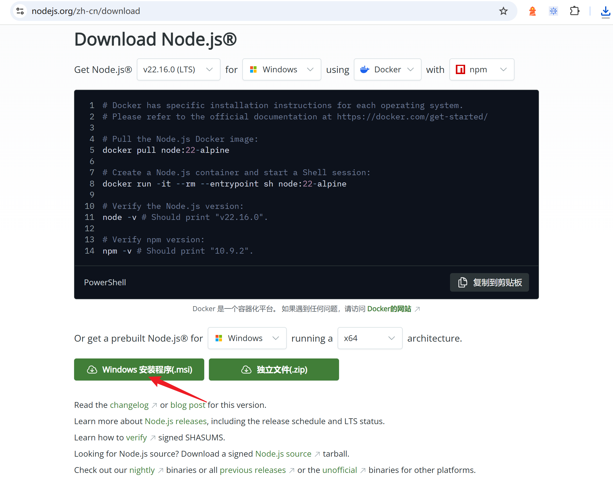

- **step2** 双击安装包，开始安装, 傻瓜式的点击 `Next`.
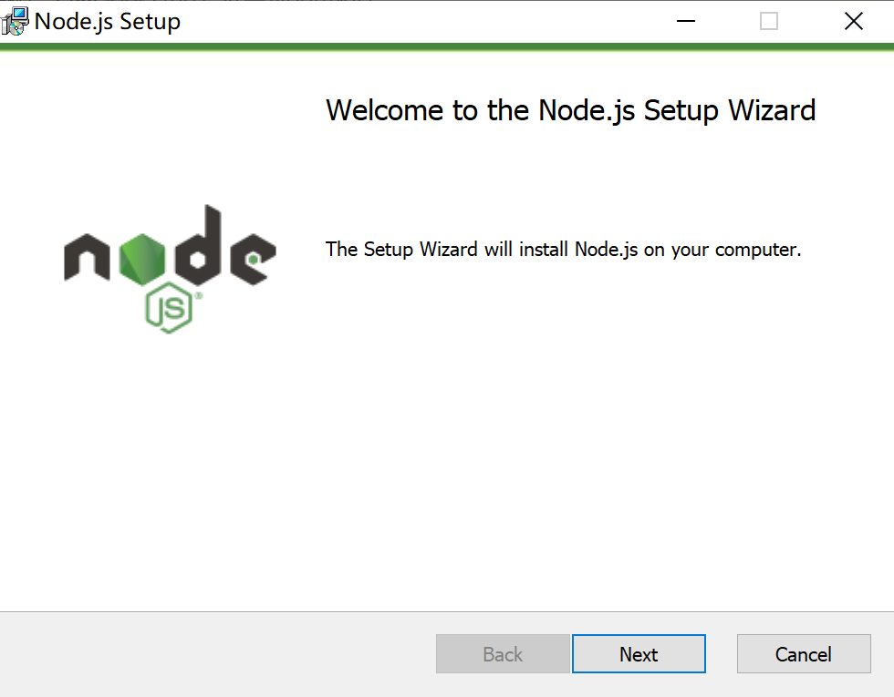

  点击 `next`
  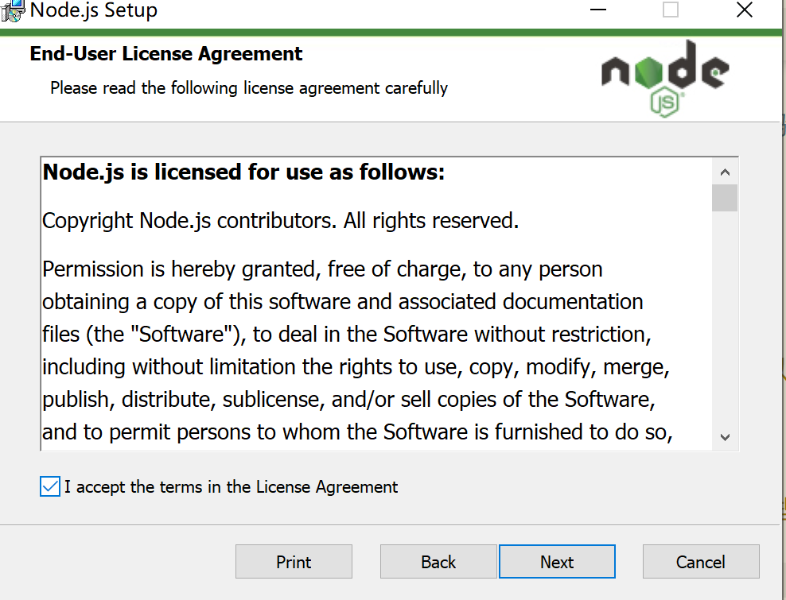

  如果你不想Node默认安装在C盘目录下，可以在这一步修改安装盘
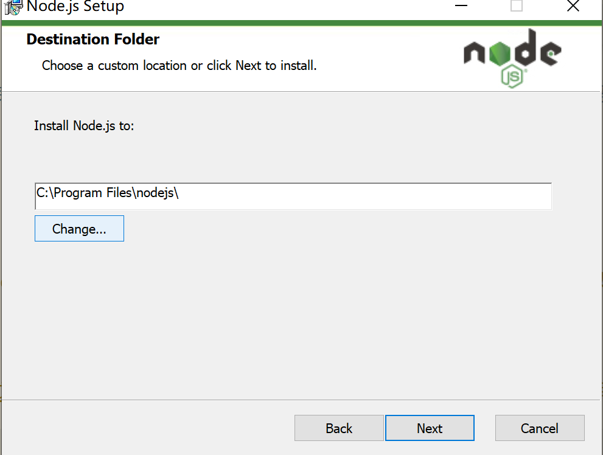

  点击 `next`
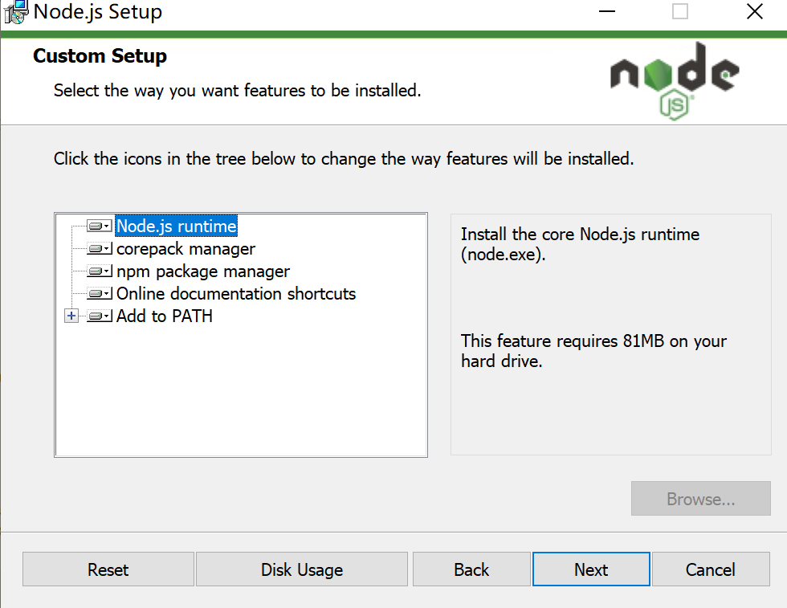

  点击 `Install`
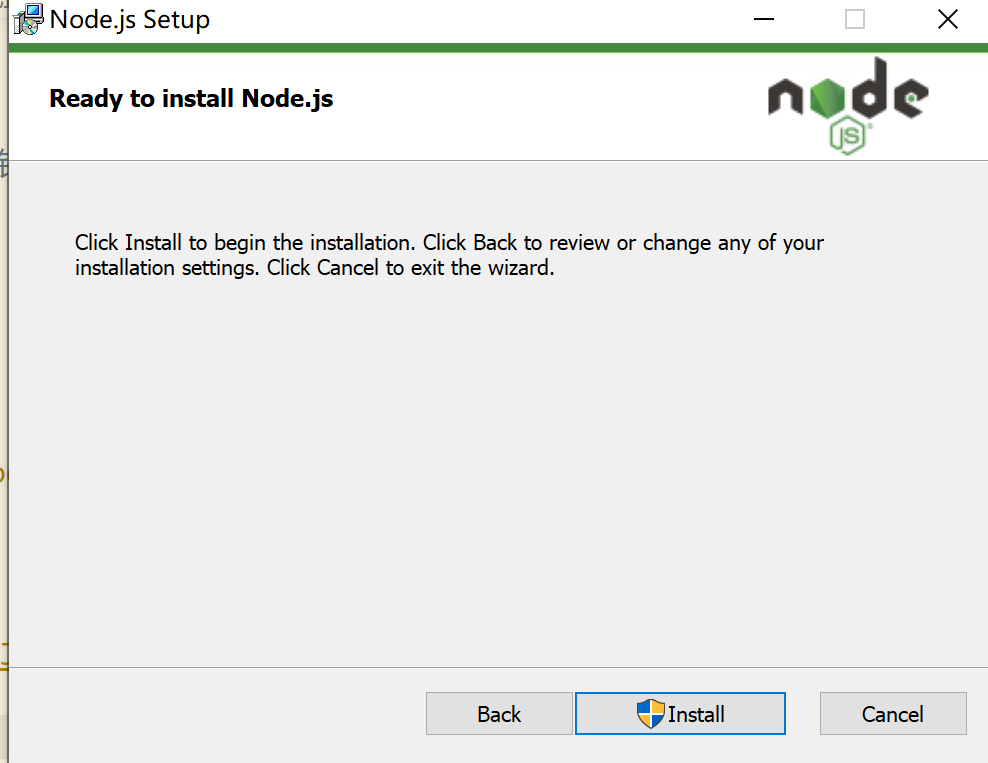

## 方法2：可移动二进制文件安装

- **step1**: 前往[Node官网](https://nodejs.org/zh-cn/download)下载安装包，或者关注公众号“我做开发那些年”，后台回复“Node独立文件包”获取。 
- **step2**: 将包解压任意目录，如我的是 在`D:\software_install\develop`下
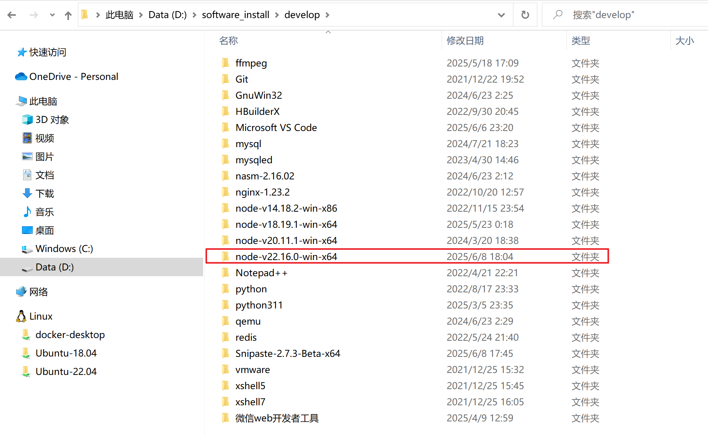
- **step3**: 将Node目录下的 `bin`下的配置到window环境变量中
  a) win+s，搜索 `环境变量`, 点击`编辑系统环境变量`

  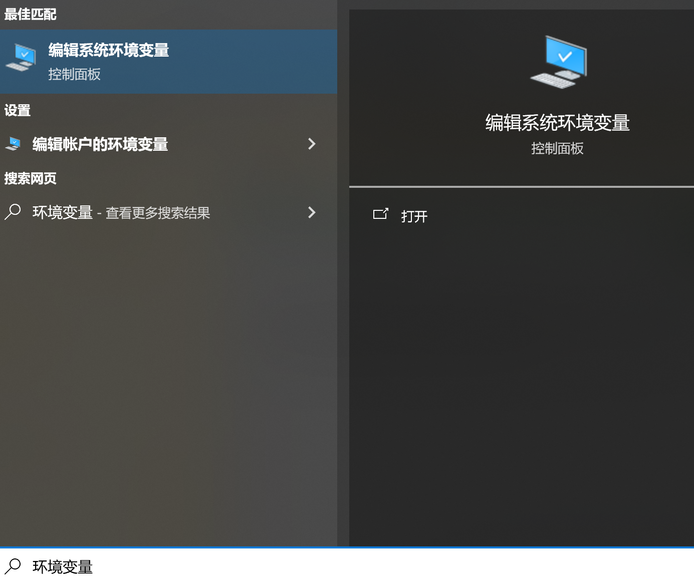

  b) 点击`环境变量`
  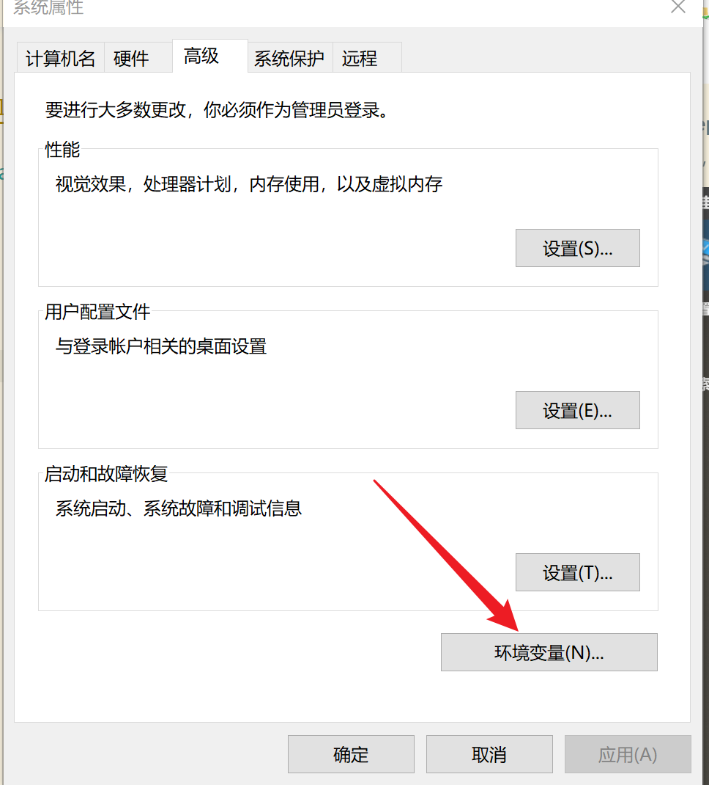
  
  c) 找到 `path`, 点击 `编辑`
  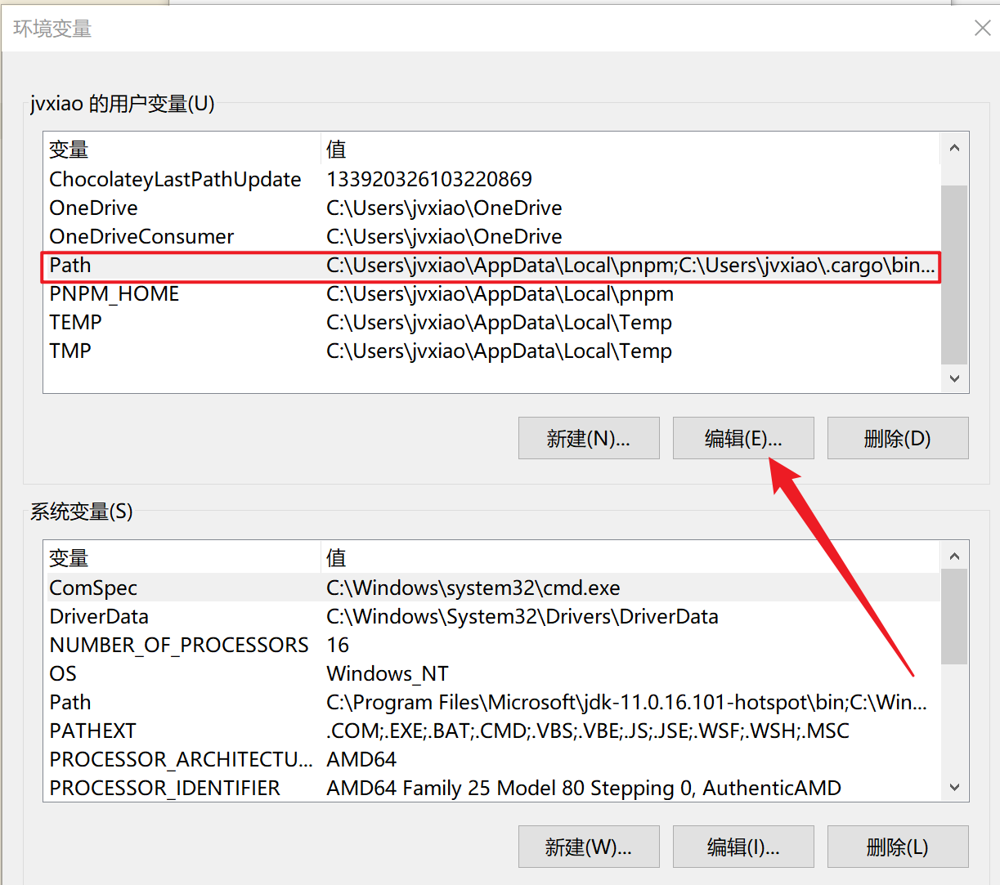

  d) 点击 `浏览`
  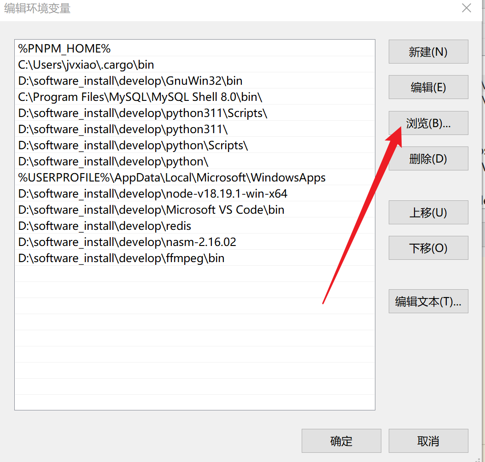

  e) 选择 step2 中解压的目录路径
  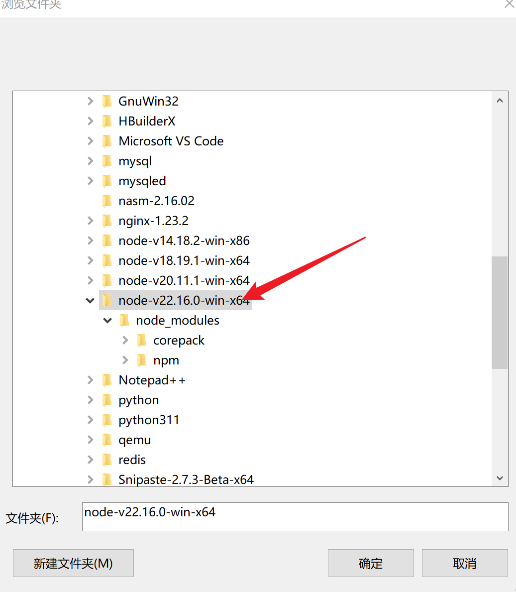

  最后点击 `确定`关闭所有窗口，将环境变量保存应用。

## 安装验证

打开DOS窗口，输入 `node -v`, 查看是否输出对应的 Node 版本号，如果有，则说明安装成功。如果报错，则重新检查安装步骤是否出错，如果需要，重新安装。

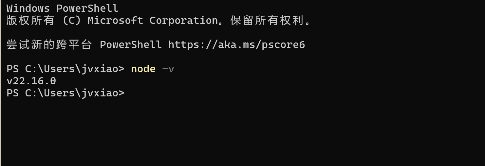
