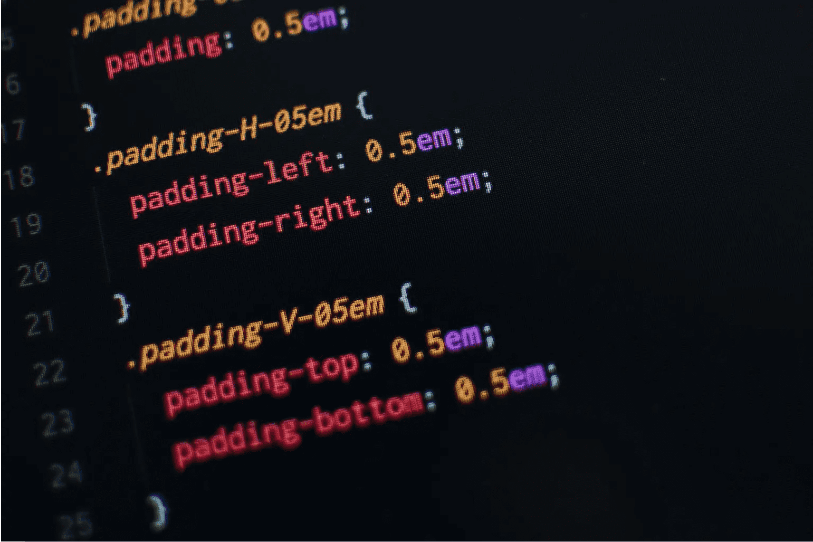

**1991年**，有个叫蒂姆・博纳斯・李的英国科学家，写了世界上第一个静态网页。这个牛人不仅创造了超文本标记语言（HTML），而且还开发出世界上第一个网页浏览器，同时也由此发明了万维网(World Wide Web), 因此他也被称为万维网之父。

早期的网页是静态的，当时的HTML标签并不丰富，当时的内容除了直接链接条状之外，没有任何的交互。到了**1994年**的时候，当时有一家有名的浏览器公司，大家应该也都听说过，叫网景(Netscape)， 它觉得页面缺少交互太单调了。脑袋一拍，Mocha出来了--也就是后来的JavaScript, JavaScript 的交互能力为网页广告弹窗(~~真讨厌~~)提供了技术基础。

页面是可以动了，但是样式还是单调了些，而且还完全取决于浏览器开发商。页面缺少布局和美化手段，太粗糙了点。在**1994年**的时候，一个叫Hkon Wiumlie的开发者提出了CSS (层叠样式表)的想法，通过编写样式实现对页面内容的布局和美化。因为后来各大浏览器厂商对CSS的支持与差异，直到两年后的1996 年，W3才推出CSS规范的第一版本。 虽然CSS因此遗留了很多历史的BUG, 但终究还是统一了战线，不读不说这是个奇迹。

到了**1995年**，网页迎来了一个巨大的转折，因为一门编程界的老梗编程语言诞生了--PHP(~~PHP是世界上最好的语言，不介绍反驳~~，不，JavaScript才是)。

PHP的出现，让页面可以访问数据内容了，不再是单一静态页面加简单的动态交互了。通过把数据从数据库中取出来，然后塞到页面里，然后再返回给浏览器，从而实现了内容上的更新。

但是这种前后端耦合的方式也带来了一个问题，就是页面需要频繁的刷新。页面中很小的变动，都会导致页面刷新，速度慢和流量消耗是个大问题。

三步之内，必有解药，不行就三年。到了**1998年**，Ajax（Asynchronous JavaScript and XML）技术概念被提出，它大喊一声，学着点。Ajax通过动态加载数据，然后通过DOM操作将数据更新到页面的方式，完美的解决了页面频繁刷新的问题。

想必后面的事情，大家都知道了，或者多少都有耳闻。 **2006年**，JQuery1.0 发布了，然后就是在Web开发中10年漫长的统治期，根据估计，到2010年，全球约90%的网站使用了JQuery。直到诸如Angular，React以及Vue等前端框架的崛起，这个Web界的王，才依依不舍离开曾经的宝座。

## 传统Web技术的痛点

类似JQuery这样封装了Ajax, DOM操作和时间处理的JS库，在很长一段时间里都是Web开发的主流技术，功能强大而且还简单易用。世界上总是没有免费的午餐的，对与JQuery来说，也是如此，它也存在着一定的不足之处。

  - 性能问题
    **DOM操作**： JQuery在处理大量DOM元素的时候可能不如原生JavaScript高效，因为其方法通常涉及遍历元素，增加了计算的开销
    **选择器**: 岁让选择器方便，但复杂的选择器可能不如现在浏览器原生方法高效，影响性能。

  - 体积问题
    它的功能很强大，代码量自然也不会少，包的体积自然光也大。在弱网或移动端情况下，影响性能。

  - 依赖性问题
   项目可能仅使用部分功能却加载整个库，造成资源浪费。与其他库的冲突可能需要额外的处理，如使用noConflict模式。

此外，2010年代，AngularJS, React和Vue.js等框架的出现，对JQuery的统治地位也构成了调账。新的MVC/MVVM模式，让用户更加方便的更新视图，在性能方面，采用虚拟DOM比传统的直接操作DOM消耗更少，更具优势。

## MVVM技术框架

- 定义：
  - Model: 数据层，与MVC的Model类似。
  - View: 视图曾，负责数据展示。
  - ViewModel: 将Model转化为View的友好格式，并处理用户交互。

- 特点：
  - 双向数据绑定：ViewModel和View之间通过数据绑定自动同步数据。
  - 简化逻辑： ViewModel承担了部分Controller的职责，简化了View和Model的交换。
  - 适用于声明编程：适合使用声明式语法（如HTML）构建视图。

MVVM通过数据双向绑定，分离关注点，简化视图逻辑、提高可测试性、支持响应式涉及和组件化开发等优势，极大地提升了前端开发的效率和代码质量。它特别适合需要复杂交互和动态数据的应用场景，如单页面应用和富客户端应用。选择MVVM模式能够帮助开发者构建更高效、更易于维护的前端应用。

## 说回 Vue

讲了那么多，终于回到我们的主题Vue了。之所以啰嗦，是希望你能够明白，无论是多么新的技术，都是有其发展历程和背景的。同时呢，无论看着多牛的技术框架，也是会有这样那样的问题的--人在挑毛病这块是无题的，而这也是技术不断往前发展的原因之一。

技术的更新发展，往往都是对前一项主流技术上进行突破或者颠覆。比如，Vue这样的JS框架，解决的不就是视图渲染问题嘛，不再需要用户去操作DOM, 用户可以更加关注数据流和用户交互。从JavaScript刚刚实现用户交互直接跨越到Vue框架，一般我们称之为神话或者穿越...

也许有一天 Vue 也被新的框架替代，但Web的故事还在继续，而我们，既是这段历史的见证者，也是下一章的书写人
